## 字符串

```java
public static void main(String[] args) {
	String s1 = "a";
    String s2 = "b";
    String s3 = "ab";
}
```

---

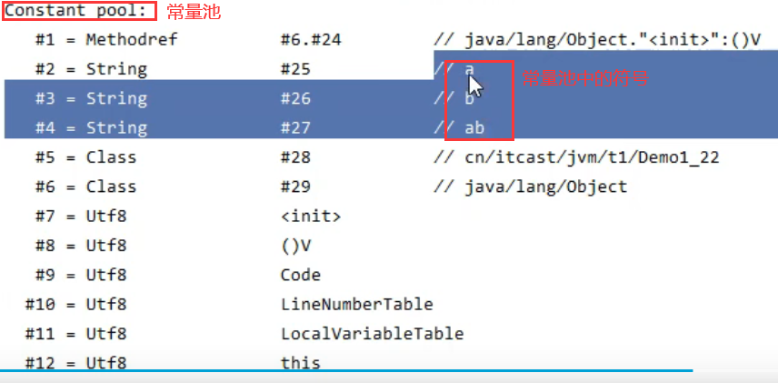

+ 常量池中的信息，都会被加载到运行时常量池中，这时a、b、ab都只是常量池中的符号，还没有变为java字符串对象。

	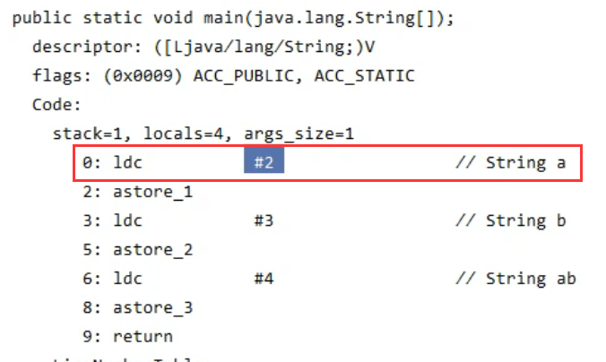

+ ldc #2 会把 **a** 符号变为 **“a”**字符串对象

+ 准备好一块空间---StringTable[   ]（哈希表结构，不能扩容），变为**“a”字符串对象**后，把“a”作为key在StringTable中查找是否有相同的key。

	+ 查找结果为不存在，则把“a”放入串池（StringTable）（b,ab同理）

	---

	```java
	public static void main(String[] args) {
		String s1 = "a";
	    String s2 = "b";
	    String s3 = "ab";
	    String s4 = s1 + s2;//new StringBuilder().append("a").append("b").toString    new String("ab")
	    //s1和s2是变量，在运行时值有可能改变，结果是不确定的
	}
	```

	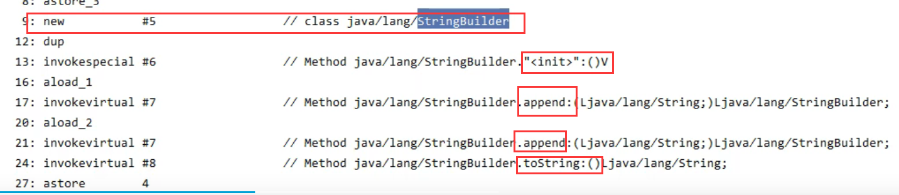

+ StringBuilder的toString实际上是创建了一个新的字符串对象

```java
@Override
public String toString() {
	return new String(value,0,count);
}
```

---

```java
//承接上文
System.out.println(s3 == s4);//false
//s3引用是StringTable中的一个字符串对象("ab")
//s4引用的是一个新的字符串对象，存放在堆中
```

---

```java
//承接上文
String s5 = "a" + "b";//javac在编译期间的优化，"a"，"b"都是常量，两者拼接的结果是确定的，结果已经在编译期间确定为"ab"
System.out.println(s3 == s5);//true
```

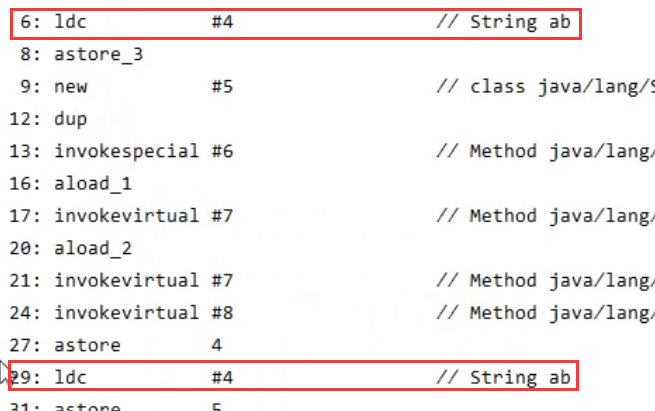

---

```java
public static void main(String[] args) {
	String s = new String("a") + new String("b");//生成"a"，"b"放在StringTable中，["a","b"]
    //new String("a")、new String("b")创建的字符串对象放在 堆 中
    //s又引用了一个对象，StringBuilder拼接了"a"，"b"，形成new String("ab")，存在于堆中（猜测：这样生成"ab"时并不会自动将"ab"放入串池--->解释:只有代码中有字符串常量的出现，从而先入了运行时常量池后，才能在代码执行时去进入串池）
    //生成了5个字符串对象+1个StringBuilder对象
    
    System.out.println(s == "ab");//false
    
    //能否将new String("ab")生成的值存入串池呢？
    String s2 = s.intern();//将这个字符串对象尝试放入串池，如果有，则不会放入；如果没有，则放入串池。不管有没有，都将串池中的对象返回
    //此时串池中：["a","b","ab"]
    System.out.println(s2 == "ab");//true
    System.out.println(s == "ab");//true，此时因为s.intern()将s引用的字符串放入了串池，故为true 
    System.out.println(s == s2);//true
}
```


```java
public static void main(String[] args) {
	String x = "ab";
    String s = new String("a") + new String("b");
    String s2 = s.intern();//s入池失败
    System.out.println(s2 == x);//true
    System.out.println(s == x);//false
}
```


---


### 总结

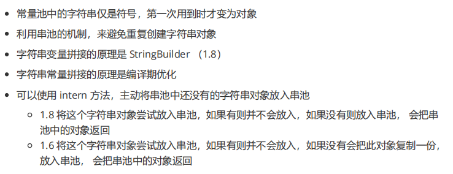

---

1.6中StringTable在永久代中

1.8中StringTable在堆中

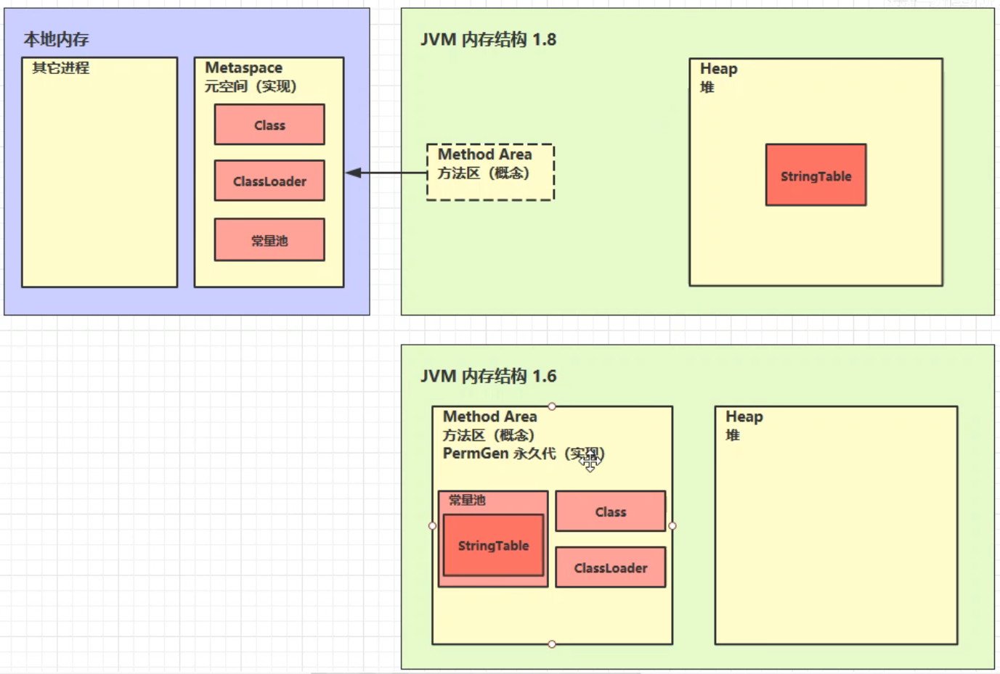

```java
// 为更容易出现内存不足的异常
// 在jdk8下设置 -Xmx10m -XX:-UseGCOverheadLimit
// 在jdk6下设置 -XX:MaxPermSize=10m
public static void main(String[] args) {
        List<Object> list = new ArrayList<>();
        int i = 0;
        try {
            for (int j = 0; j < 2600000; j++) {
                list.add(String.valueOf(j).intern());//使用list会长时间存活，保证StringTable中的值不被垃圾回收
                i++;
            }
        } catch (Throwable e) {
            e.printStackTrace();
        } finally {
            System.out.println(i);
        }
}
```


1.6中：永久代中内存空间不足

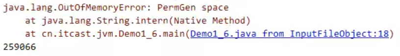

1.8中：

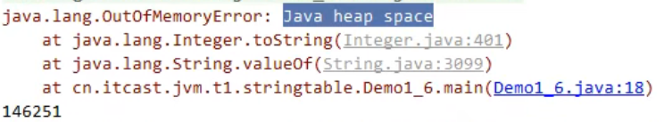


**字符串常量池** 是 JVM 为了提升性能和减少内存消耗针对字符串（String 类）专门开辟的一块区域，主要目的是为了避免字符串的重复创建。

```java
// 在堆中创建字符串对象”ab“
// 将字符串对象”ab“的引用保存在字符串常量池中
String aa = "ab";
// 直接返回字符串常量池中字符串对象”ab“的引用
String bb = "ab";
System.out.println(aa==bb);// true
```

### 字符串常量池中存放的是字符串对象的引用还是 引用+对象？？？


[JDK 6 之后的版本中，既保存了字符串对象，又保存了字符串对象的引用]: https://blog.csdn.net/hqweay/article/details/88753035

**`StringTable` 中保存的是字符串对象的引用，字符串对象的引用指向堆中的字符串对象。**

[比较有说服力？？]: https://www.zhihu.com/question/55994121/answer/408891707	"HotSpot VM里，记录interned string的一个全局表叫做StringTable，它本质上就是个HashSet&lt;String&gt;。这是个纯运行时的结构，而且是惰性（lazy）维护的。注意它只存储对java.lang.String实例的引用，而不存储String对象的内容。 注意，它只存了引用，根据这个引用可以得到具体的String对象。一般我们说一个字符串进入了全局的字符串常量池其实是说在这个StringTable中保存了对它的引用，反之，如果说没有在其中就是说StringTable中没有对它的引用。"
[]: https://ask.csdn.net/questions/7475109

[]: https://www.zhihu.com/question/267818864/answer/329226635

Java在加载字符串常量的时候会调用一遍intern，那么StringTable里就会留下这个hotspot默认创建的字符串。

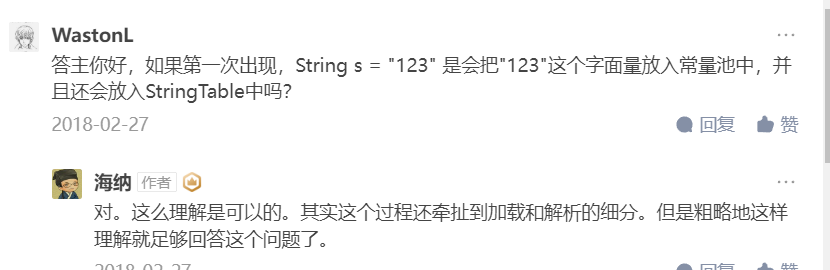

---


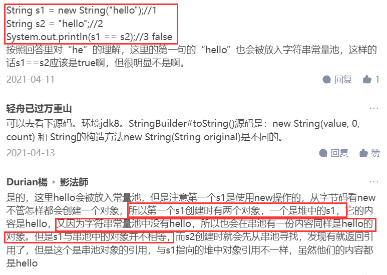

到底是哪种？存疑，貌似没有明确的说明到底哪个正确。nmmd乌鱼子啊

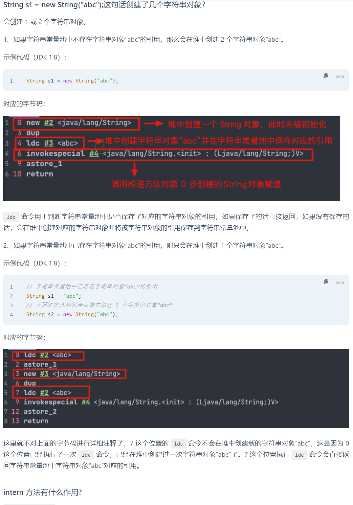

---


JDK1.8中字符串常量池和运行时常量池逻辑上属于方法区，但是实际存放在堆内存中，因此既可以说两者存放在堆中，也可以说两则存在于方法区中.
